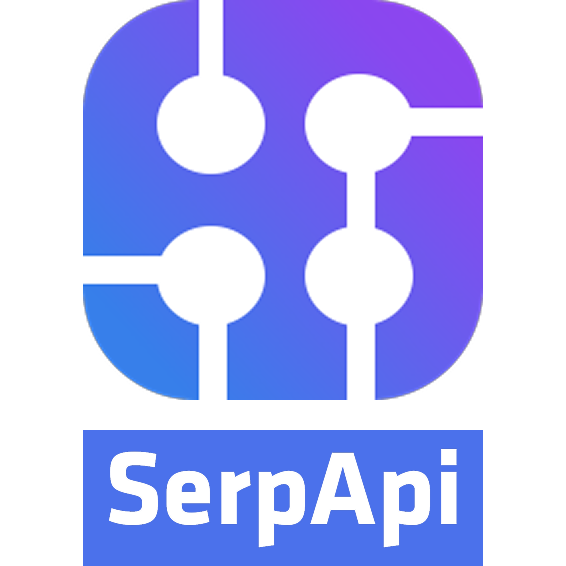

## Lexbor: Crafting a Browser Engine with Simplicity and Flexibility

Why build yet another browser engine?
There's a myriad of challenges developers face in fully utilizing modern web technologies.
Parsing HTML and CSS, dealing with URLs and encodings often involves slow, resource-heavy implementations or outdated solutions.
Even established solutions, written in C++ and reaching tens of megabytes in volume, are often not versatile enough.
Meanwhile, language-specific implementations for Python, Node.js, Rust, or any other favorite of the day are slow and prone to lock-in.


### The Core Requirements

Lexbor's core requirements rose from the ashes of these challenges:

#### Portability

Lexbor aims to adapt to different platforms and integrate into various programming languages.
It's not yet another library full of quirks and idiosyncrasies;
Lexbor aims to offer developers flexibility to incorporate it into their work directly, regardless of the programming language they chose.

#### Modularity

Lexbor wants to keep things simple: Developers should be able to use only the parts they need.
Whether it's an HTML or URL parser, the engine's code should be straightforward and easy to navigate, promoting rapid development.

#### Speed

In a nutshell, Lexbor wants things to happen *real fast*.
It's not just about making a browser engine; it's about making sure that *everything*,
even the most resource-intensive tasks such as HTML parsing, occur swiftly to meet the real-time demands of modern web applications.

#### Independence

Lexbor empowers developers by giving them full control over algorithms, resources, and dimensions.
By eliminating  on external dependencies, we let developers customize the engine without sacrificing performance or features.

#### Compliance

Lexbor commits to industry standards.
Developers need to be sure that the code aligns with widely established specifications.
The output of Lexbor's modules, be it HTML, CSS, URLs, or others, should match that of modern browsers, meeting industry specifications.


### Origin Story

Having had all these goals in mind for about a decade, Alexander Borisov,
whose name gave the project its title,
came up with the idea of a browser engine crafted entirely in C
(there's no school like the old school).
The language was chosen simply because we believed it could meet all the criteria seamlessly.

Unlike heavyweights such as WebKit or Blink, Lexbor takes a lean and focused approach,
delivering a nimble yet powerful browser engine.
All it takes is years of top-notch developer expertise.

An important point to make: Lexbor doesn't stop at parsing and rendering modern HTML.
It offers each component as a standalone entity, ready to be integrated into other people's projects.
This approach sets us apart, providing a modular solution that not only meets browser needs
but also empowers developers with versatile tools for their own web-related tasks.

All in all, we envision Lexbor a promising player in the menagerie of browser technologies,
pushing the boundaries and helping developers fully leverage modern web technologies.


## Features

* [Modules](https://github.com/lexbor/lexbor/tree/master/source/lexbor).
* [Single or separate](https://github.com/lexbor/lexbor#single-or-separately) libraries for each module.
* No outside dependencies.
* Easy to port to any platform.
* C99 support.
* Speed.

### HTML Module

* Full conformance with the [HTML5 specification](https://html.spec.whatwg.org/multipage/).
* Manipulation of [elements](https://github.com/lexbor/lexbor/blob/master/examples/lexbor/html/element_create.c) and [attributes](https://github.com/lexbor/lexbor/blob/master/examples/lexbor/html/element_attributes.c): add, change, delete and other.
* Supports fragment parsing (for [innerHTML](https://github.com/lexbor/lexbor/blob/master/examples/lexbor/html/element_innerHTML.c)).
* Supports parsing [by chunks](https://github.com/lexbor/lexbor/blob/master/examples/lexbor/html/document_parse_chunk.c).
* Passes all tree construction tests.
* [Tested](https://github.com/lexbor/warc_test) by 200+ million HTML pages with [ASAN](https://clang.llvm.org/docs/AddressSanitizer.html).
* Two way for parsing HTML: [by Document](https://github.com/lexbor/lexbor/blob/master/examples/lexbor/html/document_parse.c), [by Parser](https://github.com/lexbor/lexbor/blob/master/examples/lexbor/html/parse.c).
* Supports [determining encoding](https://github.com/lexbor/lexbor/blob/master/examples/lexbor/html/encoding.c) by byte stream.
* [Parsing CSS Styles](https://github.com/lexbor/lexbor/tree/master/examples/lexbor/styles) in tag attributes and in the `<style>` tag.
* Fast

### CSS Module

* Full conformance with the [CSS Syntax](https://drafts.csswg.org/css-syntax-3/) module.
* Supports:
* * [x] [Selectors](https://github.com/lexbor/lexbor/tree/master/examples/lexbor/selectors).
* * [x] [StyleSheet Tree](https://github.com/lexbor/lexbor/tree/master/examples/lexbor/css) (aka CSSOM).
* * [x] and so on.
* Fast.

### Selectors Module

* Search for HTML elements using CSS selectors.
* Fast.

### Encoding Module

* Full conformance with the [Encoding specification](https://encoding.spec.whatwg.org/).
* Supports `40 encodings` for encode/decode.
* Supports [single](https://github.com/lexbor/lexbor/blob/master/examples/lexbor/encoding/single/from_to.c) and [buffering](https://github.com/lexbor/lexbor/blob/master/examples/lexbor/encoding/buffer/from_to.c) encode/decode.
* Fast.

### URL Module

* Conformance with the [URL specification](https://url.spec.whatwg.org/)
* Support [Unicode ToASCII](https://www.unicode.org/reports/tr46/#ToASCII)
* Fast.

### Punycode Module

* Conformance with the [Punycode specification](https://www.rfc-editor.org/rfc/inline-errata/rfc3492.html).
* Support Encode/Decode.

### Unicode Module

* Unicode Standard Annex [#15](https://www.unicode.org/reports/tr15/).
* * Support Unicode normalization forms: D (NFD), C (NFC), KD (NFKD), KC (NFKC).
* * Support chunks (stream).
* Unicode Technical Standard [#46](https://unicode.org/reports/tr46/).
* * Support Unicode [IDNA Processing](https://www.unicode.org/reports/tr46/#Processing).
* * Support Unicode [ToASCII](https://www.unicode.org/reports/tr46/#ToASCII).
* * Support Unicode [ToUnicode](https://www.unicode.org/reports/tr46/#ToUnicode).
* Fast.

### Development of modules in process

* Layout
* Font
* and so on

## Build and Installation

### Binary packages

Binaries are available for:

* [CentOS](https://lexbor.com/download/#centos) 6, 7, 8
* [Debian](https://lexbor.com/download/#debian) 8, 9, 10, 11
* [Fedora](https://lexbor.com/download/#fedora) 28, 29, 30, 31, 32, 33, 34, 36, 37
* [RHEL](https://lexbor.com/download/#rhel) 7, 8
* [Ubuntu](https://lexbor.com/download/#ubuntu) 14.04, 16.04, 18.04, 18.10, 19.04, 19.10, 20.04, 20.10, 21.04, 22.04

Currently for `x86_64` architecture.
If you need any other architecture, please, write to [support@lexbor.com](mailto:support@lexbor.com).

### vcpkg

For vcpkg users there is a `lexbor` [port](https://github.com/microsoft/vcpkg/tree/master/ports/lexbor) that can be installed via `vcpkg install lexbor` or by adding it to `dependencies` section of your `vcpkg.json` file.

### macOS

#### Homebrew

To install `lexbor` on macOS from Homebrew:

```sh
brew install lexbor
```

#### MacPorts

To install `lexbor` on macOS from MacPorts:

```sh
sudo port install lexbor
```

### Source code

For building and installing Lexbor library from source code, use [CMake](https://cmake.org/) (open-source, cross-platform build system).

```bash
cmake . -DLEXBOR_BUILD_TESTS=ON -DLEXBOR_BUILD_EXAMPLES=ON
make
make test
```

Please, see more information in [documentation](https://lexbor.com/documentation/#source-code).

## Single or separately

### Single
* liblexbor — this is a single library that includes all modules.

### Separately
* liblexbor-{module name} — libraries for each module.

You only need an HTML parser? Use `liblexbor-html`.

Separate modules may depend on each other.
For example, dependencies for `liblexbor-html`: `liblexbor-core`, `liblexbor-dom`, `liblexbor-tag`, `liblexbor-ns`.

The `liblexbor-html` library already contains all the pointers to the required dependencies. Just include it in the assembly: `gcc program.c -llexbor-html`.

## External Bindings and Wrappers

* [Elixir](https://git.pleroma.social/pleroma/elixir-libraries/fast_html) binding for the HTML module (since 2.0 version)
* [Crystal](https://github.com/kostya/lexbor) Fast HTML5 Parser with CSS selectors for Crystal language
* [Python](https://github.com/rushter/selectolax#available-backends) binding for modest and lexbor engines.
* [D](https://github.com/trikko/parserino) Fast HTML5 Parser with CSS selectors for D programming language
* [Ruby](https://github.com/serpapi/nokolexbor) Fast HTML5 Parser with both CSS selectors and XPath support.
* [PHP](https://github.com/php/php-src)'s DOM extension uses Lexbor's HTML living standard parser and CSS selector support, starting from PHP 8.4.
* [Julia](https://github.com/MichaelHatherly/Lexbor.jl) binding for the HTML module.

You can create a binding or wrapper for the `lexbor` and place the link here!

## Documentation

Available on [lexbor.com](https://lexbor.com) in [Documentation](https://lexbor.com/documentation/) section.

## Roadmap

Please, see [roadmap](https://lexbor.com/roadmap/) on [lexbor.com](https://lexbor.com).

## Getting Help

* E-mail [support@lexbor.com](mailto:support@lexbor.com)

## Our Sponsors

[](https://goneural.ai/) [](https://serpapi.com/?utm_source=lexbor)

## Sponsorship

You can help sponsor the maintainers of this software through the following organization:
[github.com/sponsors/toxypi](https://github.com/sponsors/toxypi)

## SAST Tools

[PVS-Studio](https://pvs-studio.com/en/pvs-studio/?utm_source=website&utm_medium=github&utm_campaign=open_source) - static analyzer for C, C++, C#, and Java code.

## Status of available distributions

These are third-party distributions; we do not create them. Thank you to the community.

[](https://repology.org/project/lexbor/versions)

## COPYRIGHT AND LICENSE

   Lexbor.

   Copyright 2018-2025 Alexander Borisov

   Licensed under the Apache License, Version 2.0 (the "License");
   you may not use this file except in compliance with the License.
   You may obtain a copy of the License at

       http://www.apache.org/licenses/LICENSE-2.0

   Unless required by applicable law or agreed to in writing, software
   distributed under the License is distributed on an "AS IS" BASIS,
   WITHOUT WARRANTIES OR CONDITIONS OF ANY KIND, either express or implied.
   See the License for the specific language governing permissions and
   limitations under the License.


Please, see [LICENSE](https://github.com/lexbor/lexbor/blob/master/LICENSE) file.
